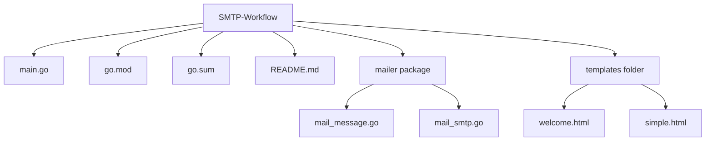

# 📧 Mailpit SMTP with Go - Complete Guide

🎯 Project Overview

A Go-based email sending system using Mailpit as a test SMTP server. This project demonstrates how to send both plain text and HTML emails via SMTP and view them in Mailpit's web dashboard.

## 📁 Project Structure

⚙️ Prerequisites
1. Software Requirements:

    Go 1.21 or higher

    Mailpit (Test SMTP Server)

    Browser (for viewing Mailpit UI)

2. Installation:
bash
# Download and install Mailpit
cd /tmp
wget https://github.com/axllent/mailpit/releases/latest/download/mailpit-linux-amd64.tar.gz
tar -xzf mailpit-linux-amd64.tar.gz
chmod +x mailpit
sudo mv mailpit /usr/local/bin/  # or keep in ~/bin/

🚀 How It Works - Step by Step
System Architecture:

┌─────────────┐    ┌─────────────┐    ┌─────────────┐
│   Go Code   │───▶│  Mailpit    │───▶│  Mailpit    │
│   (main.go) │    │  SMTP       │    │  Web UI     │
│             │    │  (Port 1025)│    │  (Port 8025)│
└─────────────┘    └─────────────┘    └─────────────┘
      │                    │                    │
      │ Send Email         │ Store Email        │ View Email
      │ via SMTP           │ in Database        │ in Browser
      ▼                    ▼                    ▼

Step-by-Step Execution:
Step 1: Start Mailpit Server
bash
# Terminal 1
mailpit --smtp :1025 --listen :8025

Expected Output:
INFO[2026-02-05T11:20:00] Mailpit v1.29.0
INFO[2026-02-05T11:20:00] SMTP server listening on [::]:1025
INFO[2026-02-05T11:20:00] HTTP server listening on [::]:8025

Step 2: Setup Go Project
bash
# Terminal 2
cd ~/Documents/SMTP\ Workflow

# Initialize Go module
go mod init smtpproject
# Install dependencies
go mod tidy

Step 3: Create Required Files
File 1: mailer/mail_message.go
File 2: mailer/mail_smtp.go
File 3: main.go

Step 4: Run the Program
bash
go run main.go

Expected Output:
📧 Starting Mailpit Test...
1. Sending Plain Text Email...
✅ Plain text email sent!
2. Sending HTML Email...
✅ HTML email sent!
📊 EMAILS SENT TO MAILPIT
==================================================

🌐 Check Mailpit Dashboard:
   http://localhost:8025

📨 Or check via terminal:
   curl http://localhost:8025/api/v1/messages
==================================================

👀 How to View Sent Emails
Method 1: Web UI (Browser)
http://localhost:8025

Method 2: Command Line
bash
# Check email count
curl -s http://localhost:8025/api/v1/messages | grep -o '"total":[0-9]*'
# List all emails
curl -s http://localhost:8025/api/v1/messages | grep -o '"Subject":"[^"]*"'
# Detailed view with jq
curl -s http://localhost:8025/api/v1/messages | jq '.messages[] | {subject: .Subject, from: .From, to: .To}'

1.HTML Email Test:

2.Plain Text Test:

📞 Support

If you encounter issues:

    Ensure Mailpit is running

    Run go mod tidy

    Refresh the browser

    Try different ports

Happy Coding! 🚀
